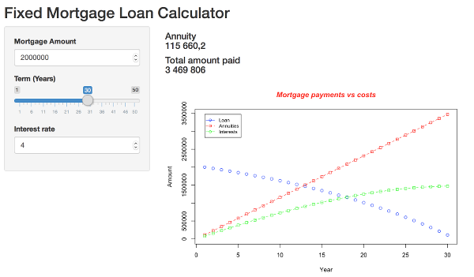

```{r setup, include=FALSE}
knitr::opts_chunk$set(echo = FALSE)
```

## Overview

This is the final project of the Developing Data Products in R course

You can find the code:

https://github.com/hal12345

## Mortgage calculator

The aim of this Shiny app is to allow you to compute the mortgage annuities and total amount one will pay for it.

###The input are quite straight forward
* Mortgage Amount
* Number of years
* Interest rate

## Rules

###The central par of this application is the annuity formula

 amount, rate, years){return(amount * (rate/100) / ( 1 - ( 1 + (rate/100))^(-years)))

Thanks to it it is possible to derive

* total amount of interest that it will be paid
* total cost of the mortgage


## Screen Shot




